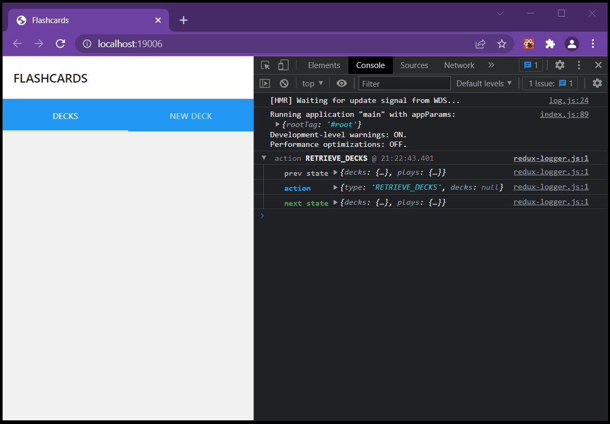

# React Mobile Flashcards

For my React Developer certification at Udacity I implemented this simple quiz game using React Native and many other technologies.

Originally in 2019 this was running on Android and I refactored it to the latest SDK versions.

## Demo



## Installation

You'll need [Expo CLI](https://docs.expo.dev/workflow/expo-cli/) installed for local development:

```bash
yarn global add expo-cli
```

Install the dependencies and start the project:

```bash
yarn install
yarn start
```

If you're running for the web just do:

```bash
yarn web
```